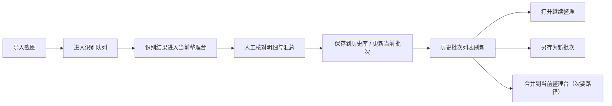

# 积存金复盘台

积存金复盘台是一个面向黄金积存金交易截图整理的本地优先网页工具。它把“截图识别、人工复核、结果汇总、历史批次管理”放在同一条工作流里，适合在你批量整理银行交易截图时使用。

当前实现聚焦招商银行黄金账户历史交易截图，优先覆盖以下场景：

- `委托买入`
- `委托卖出`
- `已撤单`
- `过期失效`
- 转换类条目

项目不是通用 OCR 平台，目标是稳定抽取交易记录，并将结果送入当前整理台、历史库与统计视图。

## 当前能力

- 导入一张或多张交易截图
- 顺序连续识别，或对单张截图重识别
- 优先走本地 Python OCR 服务，失败时回退到浏览器 OCR
- 抽取成交时间、方向、克重、成交价、金额
- 在明细表中人工核对识别结果
- 生成汇总、按成交日期复盘附表和图表
- 将当前整理结果保存到历史库，或更新当前批次
- 将当前整理结果另存为新批次
- 从历史库打开继续整理，或将旧批次合并到当前整理台
- 导出 PDF
- 导出 / 导入批次 JSON

## 运行方式

推荐直接一键启动：

```bash
npm run start
```

它会：

- 启动本地网页入口
- 启动或复用本地 OCR 服务
- 自动打开浏览器

默认访问地址：

- `http://127.0.0.1:4173`

也可以直接打开 [index.html](./index.html)，但要注意：

- 页面可以打开
- 浏览器 OCR 通常可用
- 网页本身不能主动拉起本地 Python 进程
- 如果需要更稳的本地 OCR，仍然要先启动本地服务

## OCR 链路

当前有两条识别路径：

1. 本地 OCR 服务
2. 浏览器回退链路

默认策略是：

- 前端先探测 `http://127.0.0.1:8765/health`
- 如果本地服务可用，优先调用 Python + PaddleOCR
- 如果服务不可用，回退到 `tesseract.js`
- Python 返回结构化结果后，前端还会再用共享解析器补跑一遍，优先采用结果更完整的一侧

单独启动本地 OCR 服务：

```bash
python3 -m venv .venv
.venv/bin/python -m pip install -r python/requirements-paddle.txt
npm run ocr:serve
```

默认服务地址：

- `http://127.0.0.1:8765`

## 工作流



这条工作流里有两个关键层级：

- 当前整理台：这次导入截图后形成的临时工作区
- 历史库：已经确认并保存的批次资产，存储在当前浏览器的 IndexedDB 中

当前规则是：

- 识别结果先进入当前整理台，不直接写入历史库
- `保存 / 更新` 是主动作
- `另存为新批次` 用于从当前整理结果分叉
- `合并` 只作为补充动作，不是主路径

## 历史库说明

历史库当前支持：

- 保存当前整理结果
- 更新当前绑定批次
- 打开某个历史批次继续整理
- 将当前整理结果另存为新批次
- 合并旧批次到当前整理台
- 重命名 / 删除批次
- 导出 / 导入完整批次 JSON

需要注意：

- 历史库默认保存在当前浏览器里
- 正常关闭浏览器后，通常仍会保留
- 清理浏览器站点数据、切换浏览器、无痕窗口或换设备后，可能丢失
- 当前不会自动同步到云端

## 统计口径

- 不按整张截图做“买入模式 / 卖出模式”假设
- 同一张图里若混合出现买卖，会分别归类
- 委托买入记为正克重、负金额
- 委托卖出记为负克重、正金额
- 净增持克重 = 委托买入总克重 - 委托卖出总克重
- 买入均价与卖出均价分别按对应方向独立计算

对本地 OCR 服务来说，还会区分三类结果：

- 成交：形成有效方向 + 日期 + 克重 + 成交价闭环
- 跳过：例如 `已撤单`、`过期失效`、转换类
- 复查：存在交易块，但缺少必要字段，暂时不能进成交

## 验证命令

```bash
npm run check
npm test
npm run test:python
```

覆盖范围包括：

- 前端共享解析器
- Python OCR 服务的结构化抽取
- 跳过笔数与复查口径
- `app.js` 语法检查

## 项目结构

- `index.html`：页面结构与入口
- `styles.css`：布局、抽屉与响应式样式
- `app.js`：OCR 调度、状态管理、历史库、图表、导出逻辑
- `src/`：共享 OCR 解析器与细节工具
- `python/`：本地 OCR 服务与依赖说明
- `scripts/`：一键启动与本地辅助脚本
- `tests/`：前端与 Python 回归测试
