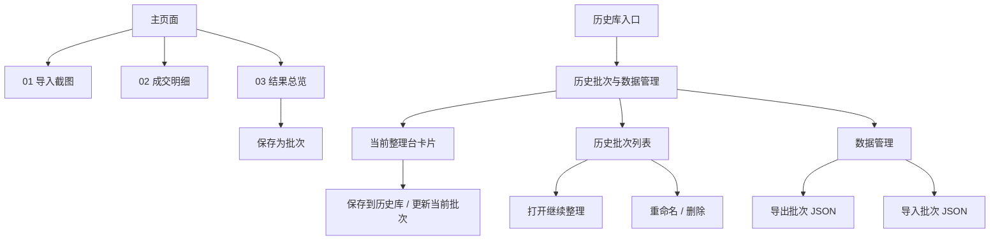
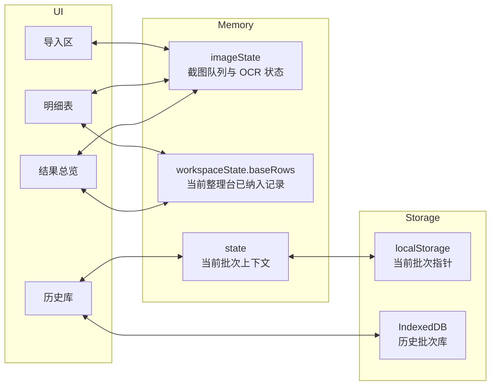
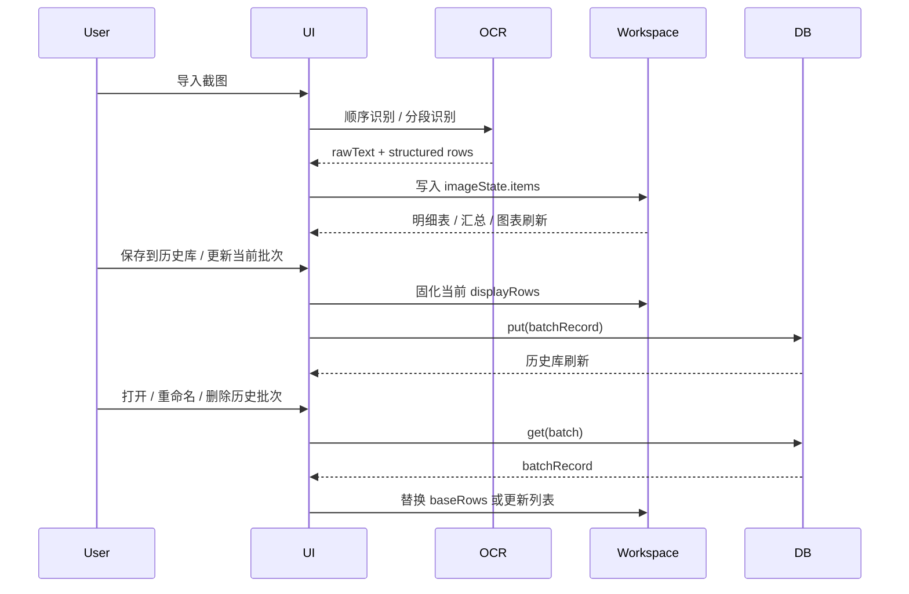
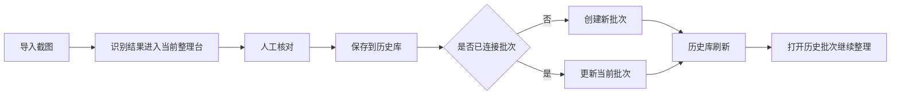
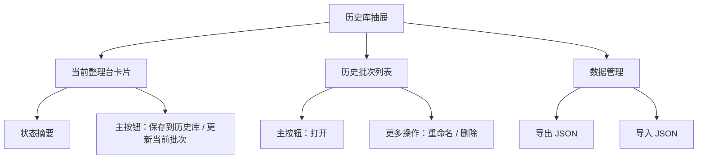

# 积存金复盘台 Design Doc

## 1. Scope

本工具只做两类任务，并明确分层：

| 层级 | 目标 | 典型动作 | 持久化 |
| --- | --- | --- | --- |
| 单次整理台 | 完成一次截图整理闭环 | 导入截图、OCR、核对明细、查看结果、保存为批次 | 默认不持久化 |
| 历史批次库 | 管理批次资产与恢复 | 保存/更新、打开继续整理、重命名、删除、导出 JSON、导入 JSON | IndexedDB |

## 2. Information Architecture



设计原则：

- `01-03` 是一次性的处理流水线。
- 历史库是独立资产层，不参与主流程编号。
- `JSON` 面向备份和恢复。

## 3. Runtime Model



### 关键状态边界

| 状态域 | 含义 | 生命周期 |
| --- | --- | --- |
| `imageState.items` | 本次新导入截图及 OCR 结果 | 临时 |
| `workspaceState.baseRows` | 当前整理台已经确认纳入的成交记录 | 会被保存/打开改变 |
| `workspaceState.batches` | 历史库列表缓存 | 来自 IndexedDB |
| `state.currentBatch*` | 当前整理台绑定的历史批次上下文 | 轻量持久化 |

核心约束：

- 展示结果 = `baseRows + 当前截图队列识别出的 rows`
- 保存批次时，展示结果会固化为历史批次，并清空截图队列
- 若当前整理台已绑定历史批次，再保存默认更新该批次
- 打开批次会替换整理台，并重建当前批次上下文

## 4. Main Data Flow



## 5. Storage Contract

历史批次 JSON 以“完整恢复”为目标，最小结构如下：

```json
{
  "version": 1,
  "exportedAt": "2026-03-20T10:00:00.000Z",
  "batches": [
    {
      "id": "uuid",
      "name": "2026-03-20 统计批次",
      "createdAt": "ISO datetime",
      "updatedAt": "ISO datetime",
      "rows": [],
      "summary": {},
      "dailySummary": []
    }
  ]
}
```

说明：

- `rows` 是恢复来源，`summary` / `dailySummary` 是派生缓存。
- 导入时会重新标准化 `rows`，保证历史数据兼容旧版本。

## 6. History Library Workflow

历史库不是“批次操作杂货铺”，而是当前整理结果的长期资产层。

### 6.1 Workflow



### 6.2 Interaction Rules

| 项目 | 结论 |
| --- | --- |
| 主保存动作 | 只保留 `保存到历史库` |
| 创建 / 更新 | 由系统自动判断 |
| 列表主动作 | `打开` |
| 次级动作 | 无单独“另存为新批次”入口 |
| 更多菜单 | `重命名`、`删除` |

### 6.3 History Drawer Structure



这个部分与 OCR 链路的边界是：

- OCR 负责把结果送入当前整理台
- 历史库负责确认后的长期保存、回访和恢复
- 不把“识别成功”直接等同于“历史资产落库”

OCR 识别链路的专项细节单独维护在 [trade-screenshot-ocr-design.md](/Users/jing/Documents/Code/gold-savings-review/docs/trade-screenshot-ocr-design.md)，总设计文档这里只保留系统层面的边界与关系。

## 7. Module Map

| 文件 | 职责 |
| --- | --- |
| `web/index.html` | 信息架构、面板与抽屉入口 |
| `web/styles.css` | 单页布局、历史库抽屉、响应式样式 |
| `web/app.js` | OCR、状态管理、图表、IndexedDB、JSON 导入导出 |

## 8. Extension Points

后续演进建议优先级：

1. 把 OCR、批次存储、导出逻辑拆成独立模块，降低 `web/app.js` 耦合。
2. 为 `rows` 引入显式 schema version，增强导入兼容性。
3. 增加 CSV 导出，但保持 JSON 作为恢复主格式。
4. 继续细化“当前整理台 / 历史批次库”之间的状态提示与冲突反馈。
