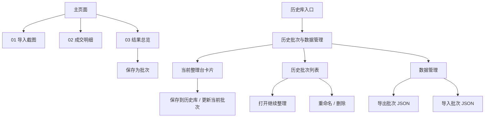
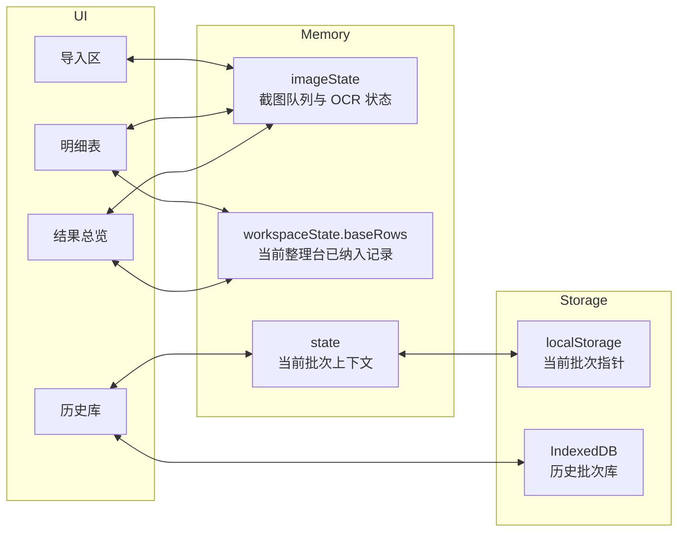
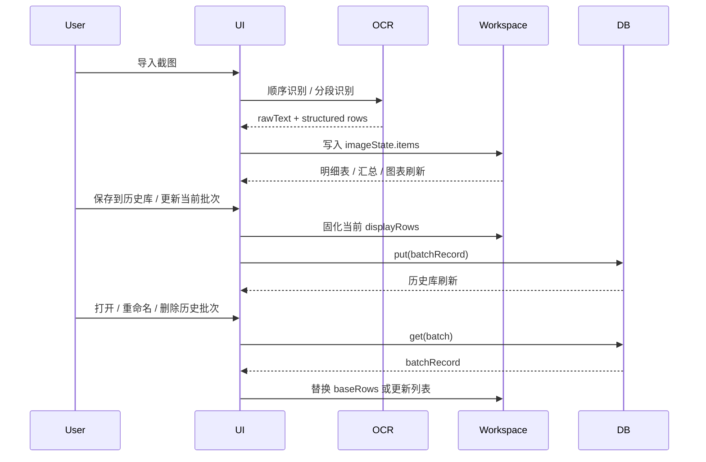
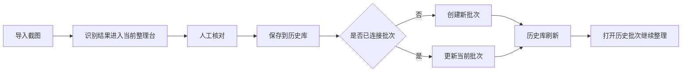
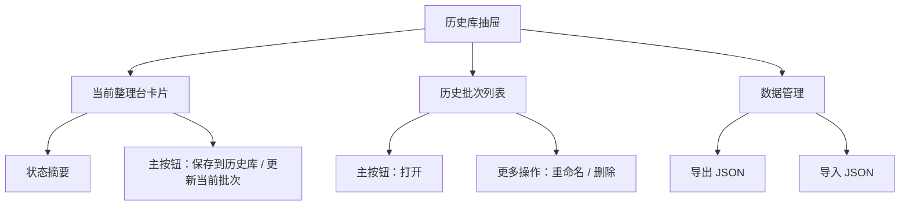

# 积存金复盘台 Design Doc

## 1. Scope

本工具只做两类任务，并明确分层：

| 层级 | 目标 | 典型动作 | 持久化 |
| --- | --- | --- | --- |
| 单次整理台 | 完成一次截图整理闭环 | 导入截图、OCR、核对明细、查看结果、保存为批次 | 默认不持久化 |
| 历史批次库 | 管理批次资产与恢复 | 保存/更新、打开继续整理、重命名、删除、导出 JSON、导入 JSON | IndexedDB |

## 2. Information Architecture



设计原则：

- `01-03` 是一次性的处理流水线。
- 历史库是独立资产层，不参与主流程编号。
- `JSON` 面向备份和恢复。

## 3. Runtime Model



### 关键状态边界

| 状态域 | 含义 | 生命周期 |
| --- | --- | --- |
| `imageState.items` | 本次新导入截图及 OCR 结果 | 临时 |
| `workspaceState.baseRows` | 当前整理台已经确认纳入的成交记录 | 会被保存/打开改变 |
| `workspaceState.batches` | 历史库列表缓存 | 来自 IndexedDB |
| `state.currentBatch*` | 当前整理台绑定的历史批次上下文 | 轻量持久化 |

核心约束：

- 展示结果 = `baseRows + 当前截图队列识别出的 rows`
- 保存批次时，展示结果会固化为历史批次，并清空截图队列
- 若当前整理台已绑定历史批次，再保存默认更新该批次
- 打开批次会替换整理台，并重建当前批次上下文

## 4. Main Data Flow



## 5. Storage Contract

历史批次 JSON 以“完整恢复”为目标，最小结构如下：

```json
{
  "version": 1,
  "exportedAt": "2026-03-20T10:00:00.000Z",
  "batches": [
    {
      "id": "uuid",
      "name": "2026-03-20 统计批次",
      "createdAt": "ISO datetime",
      "updatedAt": "ISO datetime",
      "rows": [],
      "summary": {},
      "dailySummary": []
    }
  ]
}
```

说明：

- `rows` 是恢复来源，`summary` / `dailySummary` 是派生缓存。
- 导入时会重新标准化 `rows`，保证历史数据兼容旧版本。

## 6. History Library Workflow

历史库不是“批次操作杂货铺”，而是当前整理结果的长期资产层。

### 6.1 Workflow



### 6.2 Interaction Rules

| 项目 | 结论 |
| --- | --- |
| 主保存动作 | 只保留 `保存到历史库` |
| 创建 / 更新 | 由系统自动判断 |
| 列表主动作 | `打开` |
| 次级动作 | 无单独“另存为新批次”入口 |
| 更多菜单 | `重命名`、`删除` |

### 6.3 History Drawer Structure



这个部分与 OCR 链路的边界是：

- OCR 负责把结果送入当前整理台
- 历史库负责确认后的长期保存、回访和恢复
- 不把“识别成功”直接等同于“历史资产落库”

OCR 识别链路的专项细节单独维护在 [trade-screenshot-ocr-design.md](trade-screenshot-ocr-design.md)，总设计文档这里只保留系统层面的边界与关系。

## 7. Module Map

| 文件 | 职责 |
| --- | --- |
| `web/index.html` | 信息架构、主工作区和历史库抽屉入口 |
| `web/styles.css` | 单页布局、视觉层次、历史库抽屉与响应式样式 |
| `web/app.js` | 前端装配层，只负责初始化、模块组装、统一 `update()` 和跨模块接线 |
| `web/app-shell.js` | 页面壳层 feature 入口，组合 `web/app-shell/` 目录下的持久化、状态提示、工作区文案和行情接线子模块 |
| `web/capture/images.js` | 截图导入、图片预览、拖拽/粘贴导入后的队列侧交互 |
| `web/capture/ocr.js` | OCR 编排，本地 Python OCR 服务优先，浏览器 OCR 回退 |
| `web/details.js` | 明细 feature 入口，组合 `web/details/` 目录下的排序状态、行编辑和表格渲染子模块 |
| `web/events.js` | 事件绑定入口，组合 `web/events/` 目录下按 feature 拆分的 DOM 事件绑定 |
| `web/workspace.js` | 工作区 feature 入口，组合 `web/workspace/` 目录下的状态摘要、批次列表、结果总览和按钮状态子模块 |
| `web/charts.js` | 图表渲染和图表实例生命周期管理 |
| `web/history/index.js` | 历史批次 feature 入口，组合存储层和工作区批次生命周期动作 |
| `web/history/store.js` | IndexedDB 历史批次库读写和批次列表刷新 |
| `web/history/workspace-actions.js` | 当前批次保存/更新、打开、合并、新建、重命名和删除等工作区动作 |
| `web/history/transfer.js` | 历史批次 JSON 导入导出接线 |
| `web/market/live-price.js` | 实时金价拉取与轮询，向前端提供参考行情 |
| `web/market/view-model.js` | 实时行情状态文案与收益快照拼装，把 `marketState` 和持仓数据转换为结果总览可渲染的视图模型 |
| `src/ocr-core.js` | OCR 共享解析核心，浏览器 OCR 与 Python OCR 结果都会经过这里 |
| `src/detail-tools.mjs` | 明细排序、重复检测、异常识别等纯逻辑 |
| `src/history-transfer-tools.mjs` | 历史批次导入导出和兼容性标准化纯逻辑 |
| `src/portfolio-metrics.mjs` | 收益测算纯逻辑，供网页端和后续桌面端复用 |
| `src/review-metrics.mjs` | 成交汇总、日度汇总、价格带分布、批次摘要等复盘统计纯逻辑 |

当前前端的收口原则是：

- `web/app.js` 不再承接业务计算和启发式解析，只保留装配职责。
- 可跨页面或跨运行时复用的统计/转换逻辑优先进入 `src/`。
- 结果总览里与实时行情相关的展示拼装集中在 `web/market/`，避免散落在入口文件。
- `app-shell`、`workspace`、`details`、`history`、`events` 这些高频变更域继续在各自目录内细分职责，不回退到单文件堆叠。

## 8. Structure Baseline

下面这些规则可以视为当前结构基线，后续新增 feature 默认遵守；如果未来要突破，应该先把 seam 讲清楚，再改结构。

### 8.1 Stable Entry Rules

- `web/app.js` 继续只做初始化、模块装配、统一 `update()` 和跨模块接线。
- `web/*/index.js` 或同名入口文件只做 feature 入口，不重新长成大而全实现文件。
- `src/` 继续承接可复用的计算、标准化、转换和共享 contract，不承接 DOM、IndexedDB 和浏览器事件。
- `web/market/` 是实时行情和后续历史行情 UI 接入的唯一前端入口域。

### 8.2 Feature Placement Rules

- 新增“页面壳层提示、本地偏好、工作区轻状态”能力，优先进入 `web/app-shell/`。
- 新增“工作区摘要、批次列表、结果总览、按钮状态”能力，优先进入 `web/workspace/`。
- 新增“明细视图、编辑、异常展示、按图分组”能力，优先进入 `web/details/`。
- 新增“历史批次存储、打开、合并、批次生命周期动作”能力，优先进入 `web/history/`。
- 新增“DOM 事件绑定”时，优先扩展 `web/events/` 对应 feature 文件，不回到总入口集中堆叠。
- 新增“图表渲染和图表生命周期”能力，继续进入 `web/charts.js`，除非图表域本身出现第二个清晰子 concern。

### 8.3 Change Discipline

- 新 feature 先判断归属域，再决定文件；不要从“最近的文件”开始落代码。
- 如果一个改动同时涉及 UI 渲染和纯数据变换，先把变换抽到 `src/` 或 feature 内纯辅助模块，再接回 UI。
- 如果一个 feature 入口开始重新聚集渲染、状态、编辑、存储三类以上职责，说明应该再次做目录内拆分。
- 结构性改动完成后，至少同步更新 `web/README.md`；如果属于长期系统事实，还要同步 `docs/design-doc.md`。

### 8.4 What Is Not Frozen

- 目录内的子模块划分可以继续演进。
- feature 入口参数面可以继续收窄。
- `charts` 目前保留单文件实现，不等于以后永远不能拆。
- 新增历史行情、桌面端或自动化能力时，可以扩展新模块，但应沿现有 feature-first 结构进入。

## 9. Extension Points

后续演进建议优先级：

1. 继续收窄各 feature API 的依赖面，尤其是历史库、结果总览和图表模块之间的参数传递。
2. 为 `rows` 引入显式 schema version，增强导入兼容性。
3. 在 `web/market/` 和 `src/` 之间增加独立的历史行情时间序列能力，但默认不把市场历史写入批次 JSON。
4. 增加 CSV 导出，但保持 JSON 作为恢复主格式。
5. 继续细化“当前整理台 / 历史批次库”之间的状态提示与冲突反馈。
