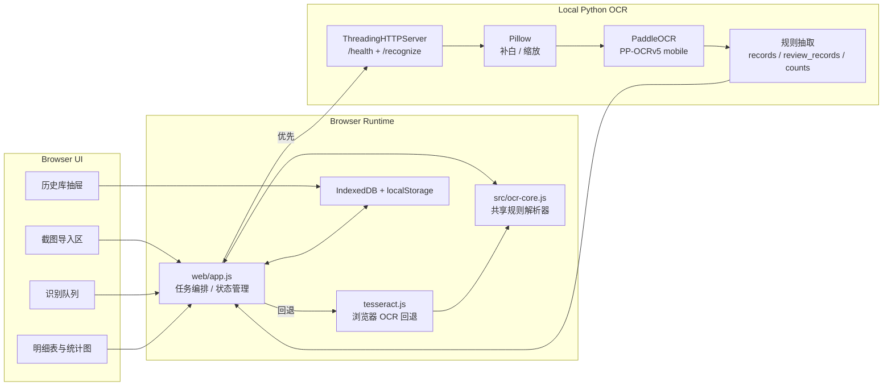
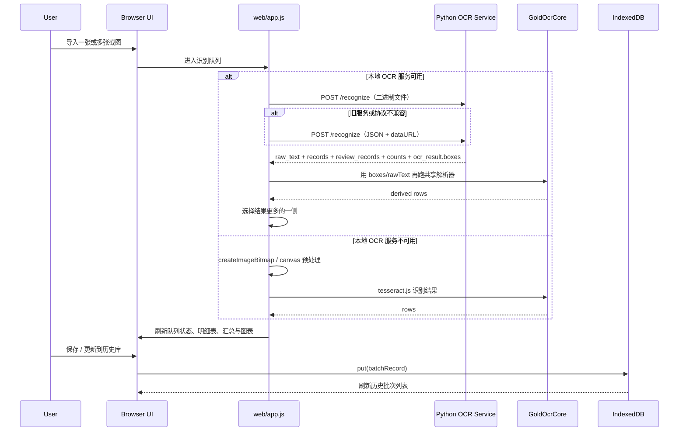
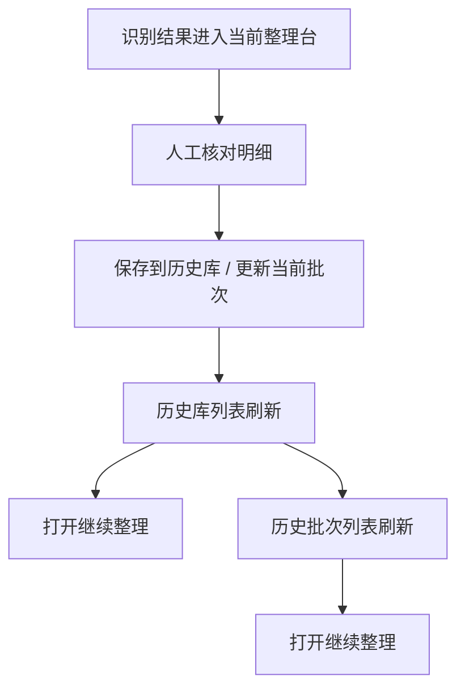

# 交易截图 OCR 抽取链路 Design Doc

## 1. Scope

当前 OCR 链路服务于 [积存金复盘台](/Users/jing/Documents/Code/gold-savings-review/web/index.html)，目标不是“通用 OCR 平台”，而是稳定抽取招商银行黄金账户历史交易截图中的成交记录，并将结果送入前端整理台、历史库与统计图表。

| 层级 | 目标 | 当前实现 | 产物 |
| --- | --- | --- | --- |
| 浏览器整理台 | 导入截图、发起识别、展示与复核 | `web/index.html` + `web/app.js` + `src/ocr-core.js` | 明细表、汇总、历史库动作 |
| 本地 OCR 服务 | 提供更稳的识别与规则抽取 | `python/paddle_ocr_service.py` | `records` / `review_records` / `counts` |
| 浏览器回退链路 | 服务不可用时保证可用性 | `tesseract.js` + `src/ocr-core.js` | `rows` |

边界说明：

- 目标页面是“黄金账户 -> 历史交易 / 交易明细列表”。
- 当前重点覆盖 `委托买入`、`委托卖出`、`已撤单`、`过期失效`、转换类条目。
- 当前不做通用版式分类器，也不输出通用文档结构树。

## 2. Runtime Architecture



设计原则：

- Python 服务负责“更稳的 OCR + 首轮结构化抽取”。
- 浏览器里的 `src/ocr-core.js` 既是浏览器 OCR 的主解析器，也是 Python 返回结果的补偿解析器。
- 同一套解析规则尽量共享，减少“服务端可识别、前端不可展示”的偏差。

## 3. End-to-End Flow



## 4. Technology Stack

### 4.1 Browser Side

| 模块 | 技术 | 当前用途 |
| --- | --- | --- |
| 页面结构 | HTML | 上传区、明细表、结果总览、历史库抽屉 |
| 交互与状态 | Vanilla JavaScript | OCR 调度、状态缓存、IndexedDB、图表渲染 |
| 浏览器 OCR | `tesseract.js@5` | 本地服务不可用时的回退识别 |
| 共享解析器 | `src/ocr-core.js` | 从 `rawText` / `lines` / `words` 提取结构化成交 |
| 图表 | `Chart.js@4` | 日度克重、均价、分布图 |
| 本地持久化 | IndexedDB + localStorage | 历史批次库、当前 UI 偏好 |

### 4.2 Python Side

| 模块 | 技术 | 当前用途 |
| --- | --- | --- |
| HTTP 服务 | `ThreadingHTTPServer` | `/health` 与 `/recognize` |
| 图像预处理 | Pillow | 补白、自适应缩放、临时文件保存 |
| OCR 引擎 | PaddleOCR | 中文识别与坐标输出 |
| 检测模型 | `PP-OCRv5_mobile_det` | 文本检测 |
| 识别模型 | `PP-OCRv5_mobile_rec` | 文本识别 |
| 结构化抽取 | 正则 + 空间规则 | 生成 `records`、`review_records`、`counts` |

### 4.3 Startup / Local Dev

| 入口 | 位置 | 作用 |
| --- | --- | --- |
| `npm run start` | `scripts/start-local.mjs` | 一键启动本地页面与 OCR 服务 |
| `npm run ocr:serve` | `python/paddle_ocr_service.py` | 单独启动 OCR 服务 |
| `积存金复盘台.app` | 项目根目录 | 通过 iTerm 进入项目目录后执行 `npm run start` |

## 5. Recognition Strategy

### 5.1 Image Preprocess

Python 侧当前策略：

- 用白底补白降低贴边文字漏检。
- 根据最长边做自适应缩放，而不是固定大倍率放大。
- 统一保存为临时图片后送给 PaddleOCR。

浏览器回退链路当前策略：

- 优先 `createImageBitmap`，失败再退回 `HTMLImageElement`。
- 对超长图做分段识别，再按重叠区合并结果。

### 5.2 Shared Parsing

`src/ocr-core.js` 当前是共享规则中枢，支持两类输入：

- 纯文本：`rawText`
- 结构化 OCR：`lines` / `words` / `bbox`

当前解析器集合：

| 解析器 | 作用 |
| --- | --- |
| `structured-bank-history-entries` | 优先使用结构化坐标还原交易块 |
| `bank-history-blocks` | 基于按行方向块切分 |
| `bank-history-chunks` | 针对连续文本、换行不稳定场景 |
| `deal-price-windows` | 以 `成交价` 为锚点做窗口搜索 |
| `loose-direction-blocks` | 更宽松的兜底块解析 |

选择机制：

- 每个解析器都产出 `rows / skippedCount / matchedCount / score`
- 按行数、时间完整度、字段合理性、漏配数量综合评分
- 选得分最高且 `rows.length > 0` 的结果

### 5.3 Python Rule Extraction

Python 服务返回的结构化结果不是直接“相信到底”，而是作为前端候选结果之一。它当前做的事情包括：

- OCR box 按 `y/x` 排序。
- 用垂直间距将 box 聚成 line。
- 以 `委托买入` / `委托卖出` / 转换类文本为 entry 起点。
- 对每个 entry 提取日期、克重、成交价、金额。
- 将 `已撤单`、`过期失效`、转换类等归入 `excluded_entry`。
- 返回 `counts.total_entries / extracted_records / skipped_entries / review_entries`。

## 6. Data Contracts

### 6.1 `/recognize` Response

当前实际返回结构：

```ts
type RecognizePayload = {
  ok: true;
  engine: "paddleocr-python";
  image_id: string;
  raw_text: string;
  records: StructuredTradeRecord[];
  review_records: ReviewRecord[];
  counts: {
    total_entries: number;
    extracted_records: number;
    skipped_entries: number;
    review_entries: number;
  };
  ocr_result: {
    boxes: OcrBox[];
  };
};
```

### 6.2 Structured Record

```ts
type StructuredTradeRecord = {
  source: "screenshot";
  record_type: "gold_trade";
  fields: {
    trade_action: "buy" | "sell";
    trade_action_text: "委托买入" | "卖出";
    order_amount_cny: number;
    trade_date: string; // YYYY-MM-DD
    weight_g: number;
    deal_price_cny: number;
  };
};
```

### 6.3 Review Record

```ts
type ReviewRecord = {
  reason: "excluded_entry" | "missing_deal_price" | "missing_required_fields";
  category: "skipped" | "review";
  text: string;
};
```

说明：

- `excluded_entry` 目前被视为“规则跳过”。
- 其他原因进入“复查”口径，但当前样本中多数仍是 `excluded_entry`。
- 前端统计 `skippedCount` 时优先使用服务端 `counts.skipped_entries`，没有时再回退到 `review_records` 计算。

## 7. Field Rules

### 7.1 成交成立条件

一条记录进入 `records` 需要满足：

- 方向可识别
- 日期可识别
- 克重 > 0
- 成交价 > 0
- 若金额存在，则优先参与一致性校验

### 7.2 自动纠偏

当前仅做有限纠偏，不做开放式猜测：

- 已知金额 + 克重，可反推成交价
- 已知金额 + 成交价，可反推克重
- 三者均存在且差值很小，可做有限归一
- 价格接近整数时允许按 0.01 级误差修正

### 7.3 跳过与复查

| 类别 | 当前规则 |
| --- | --- |
| 跳过 | `excluded_entry`，例如撤单、过期、转换类 |
| 复查 | 有 entry，但缺失成交闭环，如缺成交价 / 缺必要字段 |
| 成交 | 形成有效方向 + 日期 + 克重 + 成交价闭环 |

## 8. History-Library Interaction

OCR 链路与历史库的关系不是“识别后立刻持久化”，而是：



这里的关键边界是：

- OCR 结果先进入工作区，不直接写入历史库。
- 历史库代表“已确认、可继续追踪”的批次资产。
- `保存 / 更新` 是主动作，批次恢复通过 `打开` 进入。

## 9. Verification

当前已有验证方式：

| 类型 | 命令 | 覆盖点 |
| --- | --- | --- |
| 前端解析器 | `npm test` | `src/ocr-core.js`、细节工具 |
| Python 服务 | `npm run test:python` | `extract_records_from_boxes`、跳过口径 |
| 语法检查 | `npm run check` | `web/app.js` |

重点回归样本：

- 有效成交 + 过期失效混排
- 连续文本、换行不稳定
- 小额成交金额
- `1054.99 -> 1055` 级别的有限纠偏
- 顶部筛选栏不应计入跳过笔数

## 10. Known Gaps

当前文档必须明确承认的实际限制：

1. Python 服务与浏览器共享解析器仍存在重复逻辑，长期看应继续收敛。
2. 某些复杂长图仍可能出现 entry 切分过严或过松的问题。
3. 浏览器直接打开 `web/index.html` 时，无法由网页主动拉起本地 Python 进程。
4. 当前仍以规则抽取为主，对未来文案变体的鲁棒性有限。

## 11. Next Steps

后续优先级建议：

1. 将 Python 侧 entry 切分与浏览器侧解析器进一步统一，减少双维护。
2. 为 `review_records` 增加更细的原因分类，便于前端解释“为什么没进成交”。
3. 给 OCR 结果增加诊断视图，支持查看 `raw_text`、box、parser 命中情况。
4. 将当前启动方式沉淀为更稳定的桌面入口或常驻后台服务。
